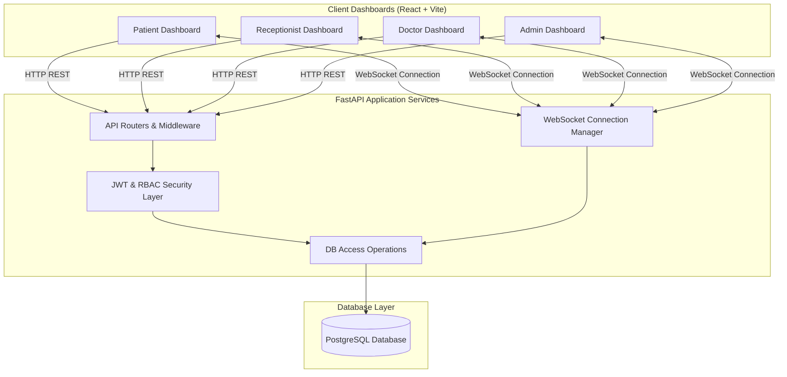

# SmartCheck AI — Patient Check-In Confirmation Experience

SmartCheck AI is a production-quality, full-stack, real-time healthcare patient check-in platform designed for **Sporting Ethos**. It eliminates the uncertainty associated with QR-based check-ins by providing instant audio-visual verification, digital tokens, live queue positions, and real-time alerts synchronized instantly across multiple role-based dashboards.

---

## 🏗️ System Architecture

The following diagram illustrates how the frontend React client connects to the FastAPI server via REST APIs and a real-time WebSockets connection layer:



---

## 🌟 Core Features

### 🩺 Patient Portal
*   **Secure Authentication**: Role-based access with JWT security.
*   **QR Scanner Simulator**: Simulates a physical camera scan of the patient's appointment code for easy demonstration.
*   **Visual Success Screen**: A premium Framer Motion animation checkmark overlay upon successful check-in.
*   **Text-to-Speech (TTS) Confirmation**: Native speech synthesis reading: *"Welcome John Doe, your check-in is confirmed."*
*   **Digital Token Ticket**: Beautiful card ticket showing the assigned token ID (e.g. `TKN-003`).
*   **Live Queue Tracker**: Displays position in queue and real-time estimated waiting time.
*   **Anxiety-Free Delay Notices**: Instantly updates if a doctor announces a delay.
*   **Check-in Feedback**: 5-star rating scale and suggestion field.

### 🖥️ Reception Dashboard
*   **Live Metrics**: Counter panel tracking Scheduled, Checked-In, Waiting, In-Consultation, and Completed visits.
*   **Manual Override**: Verification controls allowing staff to manually check in patients who forgot their QR codes.
*   **Walk-in Registration**: Instantly registers a new patient profile, books an appointment, and triggers check-in in one click.
*   **Duplicate Detection**: Displays a safety warning alert if a QR code is scanned twice.
*   **Audio Alerts**: Generates synthesized chimes using Web Audio API for a loud chime alert upon check-in events.

### 🥼 Doctor Dashboard
*   **Live Patients Queue**: An ordered list of patients currently waiting for them, highlighting who is currently in consultation.
*   **Consultation Status Workflow**: Transition patients from *Waiting* to *In Consultation* (announcing room guidance to the patient) to *Completed*.
*   **Delay Announcement Broadcaster**: If a session runs long, the doctor can declare a delay (e.g., +15 mins) that updates all patient panels in real-time.

### 📊 Admin Panel
*   **System Analytics**: Tracks total patients, registered doctors, appointments, and QR scanner usage statistics.
*   **Peak Hours Analysis**: SVG line/bar chart displaying peak check-in frequencies.
*   **Device Status Monitoring**: Monitors lobby kiosks and reception scanners ping rates.
*   **Security Audit Trail**: Tracks system actions, emails, actions, and details.

---

## 🛠️ Tech Stack

*   **Frontend**: React, Vite, TypeScript, Tailwind CSS, Zustand (State Management), React Query (Server Sync & Invalidation), Framer Motion (Transitions).
*   **Backend**: FastAPI (Python), SQLAlchemy (ORM), WebSockets (Real-time Broadcast), JWT Authentication, Passlib (Password hashing).
*   **Database**: PostgreSQL (Docker-Compose), SQLite (fallback for standalone mode).

---

## 🚀 How to Run the Application

### Option A: Using Docker Compose (Recommended)
This launches the database, FastAPI backend, and React Nginx frontend in a containerized environment.

1.  Ensure you have **Docker** and **Docker Compose** installed.
2.  Open your terminal in the project root directory.
3.  Build and launch the containers:
    ```bash
    docker-compose up --build
    ```
4.  Once running, access the services:
    *   **Frontend Client**: [http://localhost:3000](http://localhost:3000)
    *   **API Services**: [http://localhost:8000](http://localhost:8000)
    *   **Interactive API Docs (Swagger)**: [http://localhost:8000/docs](http://localhost:8000/docs)

---

### Option B: Standalone Local Mode (Without Docker)
You can run the backend and frontend locally on your machine with SQLite fallback.

#### 1. Setup Backend
1.  Navigate to `backend` directory.
2.  Create a virtual environment and activate it:
    ```bash
    python -m venv venv
    # Windows:
    .\venv\Scripts\activate
    # macOS/Linux:
    source venv/bin/activate
    ```
3.  Install Python dependencies:
    ```bash
    pip install -r requirements.txt
    ```
4.  Start the FastAPI application:
    ```bash
    python -m uvicorn app.main:app --reload --host 0.0.0.0 --port 8000
    ```

#### 2. Setup Frontend
1.  Navigate to `frontend` directory.
2.  Install Node dependencies:
    ```bash
    npm install
    ```
3.  Start the Vite dev server:
    ```bash
    npm run dev
    ```
4.  Open [http://localhost:3000](http://localhost:3000) in your browser.

---

## 🔑 Hackathon Preset Accounts

For testing, use the following logins (all use password: `SportingEthos2026!`):

| Role | Username (Email) | Purpose |
| :--- | :--- | :--- |
| **Patient** | `patient@sportingethos.com` | Scan QR code simulation, view digital token, estimated wait, and live queue position. |
| **Receptionist** | `reception@sportingethos.com` | View live counts, manually check in patients, register walk-in patients. |
| **Doctor** | `doctor@sportingethos.com` | Start/Complete consultations, broadcast delay alerts. |
| **Admin** | `admin@sportingethos.com` | Monitor system statistics, peak hour counts, device pings, audit logs. |

---

## 💡 Quick Demo Flow
1.  Open **Reception Dashboard** and **Patient Dashboard** in two side-by-side browser windows.
2.  Log in as `reception@sportingethos.com` on the first window. Notice the live dashboard state showing 1 patient checked in.
3.  Log in as `patient@sportingethos.com` on the second window. Note that they have an appointment today and are pending check-in.
4.  On the Patient window, click **Trigger QR Beep Scan**.
5.  **Observe**:
    *   The Patient window shows a beautiful checkmark success animation and speaks: *"Welcome John Doe..."*
    *   The Reception window instantly chimed (Web Audio synth) and added the patient to the Live Queue.
    *   Log in on a third window as `doctor@sportingethos.com`. They will see John Doe in their queue list. Click **Call Patient to Consultation**.
    *   **Observe**: The Patient window instantly speaks: *"Attention please, John Doe, please proceed to room 101."* and updates status.
